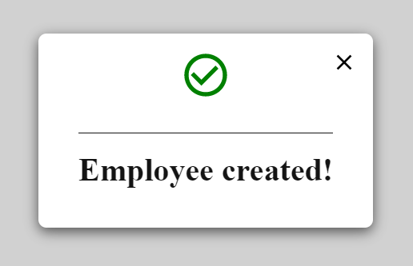

#### Simple-component-library of React components created using

`create-react-app`

<hr>

#### To install the library:

`npm install modal_mm`

<hr>

#### How import the library

`Import {Modal} from 'modal-mm'`

<hr>

#### Usage/Example

You can write little messages inside of the modal. For this example, I have used **content="Employee created!"**.

```javascript
import { Modal } from "modal_mm";
import { useState } from "react";
function App() {
  const [showModal, setShowModal] = useState(false);

  const openModal = () => {
    setShowModal((prev) => !prev);
  };

  return (
    <div className="App">
      <button onClick={openModal}>Click Me</button>
      <Modal
        showModal={showModal}
        setShowModal={setShowModal}
        content="Employee created!"
      />
    </div>
  );
}
export default App;
```

**Here an example**

  
