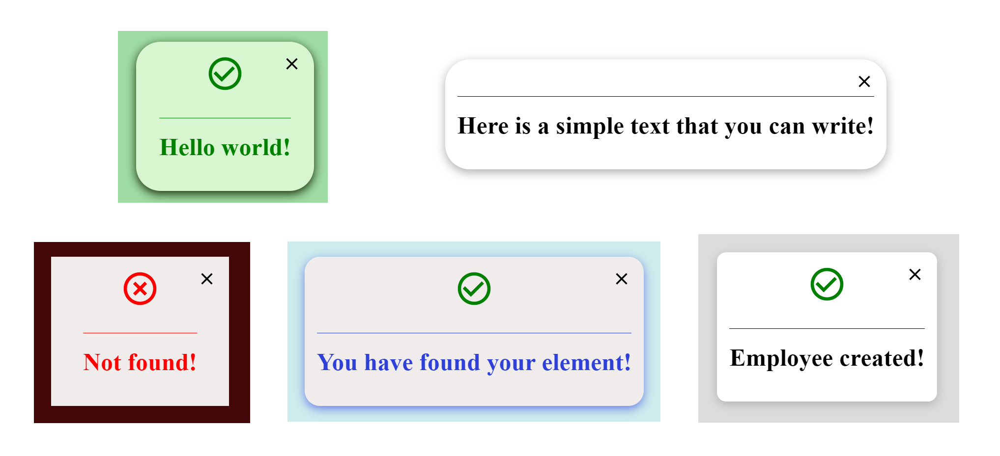

### Simple-component-library of React components created using create-react-app

<hr>

#### To install the library:

`npm install modal_mm`

<hr>

#### How import the library

`Import {Modal} from 'modal-mm'`

<hr>
#### Usage/Example
You can change the color of modal's background, you can also change the color of the modal. You can change the text and also its color inside modal. You can decide which icon you want (success or error) or nothing. And also you can change the shadow and the border-radius of the modal. If you decide not to use one, just comment it and it will not appear inside the modal.

For example, I have used:

```bash
  backgroundColor="#16a92069"
  colorModal="rgba(215, 246, 207, 1)"
  iconModal="success"
  borderModal="40px"
  content="Hello world!"
  contentcolor="green"
  shadowModal="0 5px 16px rgba(18, 39, 3, 1).
```

<hr>

```javascript
import Modal from "./lib/components/Modal";
import { useState } from "react";
function App() {
  const [showModal, setShowModal] = useState(false);

  const openModal = () => {
    setShowModal((prev) => !prev);
  };

  return (
    <div className="App">
      <button onClick={openModal}>Click Me</button>
      <Modal
        showModal={showModal}
        setShowModal={setShowModal}
        //your custom parameters
        backgroundColor="#16a92069"
        colorModal="rgba(215, 246, 207, 1)"
        iconModal="success"
        borderModal="40px"
        content="Hello world!"
        contentcolor="green"
        shadowModal="0 5px 16px rgba(18, 39, 3, 1)"
        //your custom parameters
      />
    </div>
  );
}

export default App;
```

#### Setup

| Parameter         | Type     | Description                     |
| :---------------- | :------- | :------------------------------ |
| `backgroundColor` | `string` | Change the background of modal  |
| `colorModal`      | `string` | Change the color of modal       |
| `iconModal`       | `string` | Change icon (success or eror)   |
| `content`         | `string` | Change the message of modal     |
| `contentcolor`    | `string` | Change the color of the message |
| `shadowModal`     | `string` | Change the shadow of modal      |
| `borderModal`     | `string` | Change the border of modal      |

<hr>

**Here an example**

  
